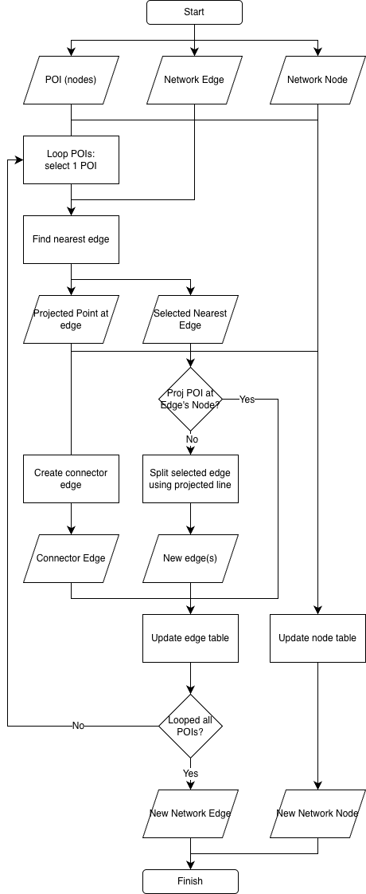

# Integrate Custom POI to a Network Graph

This repository contains Python scripts used to integrate custom Point of Interest (POI) data into an existing road network graph derived from OpenStreetMap (OSM). The integration enables network-based analysis such as shortest path, accessibility analysis, and routing to/from custom POI locations.

The analysis utilizes:
- OSM road network data (nodes and edges) downloaded via OSMnx,
- custom POI data in GeoPackage format,
- and geospatial processing libraries for network topology manipulation.

The project aims to produce a topologically consistent network graph where custom POIs are properly connected to the nearest road segment, enabling downstream routing and spatial analysis workflows.

---

# Methodology

<p align="center">
  
</p>

Custom POI geometries were projected onto the nearest road edge using Shapely. Depending on the projected point location, either a new node was inserted by splitting the edge, or the POI was connected directly to an existing node. Connector edges were added bidirectionally to maintain compatibility with directed graph structures (MultiDiGraph).

## Processing Steps

1. Collected:
   - OSM road network (nodes and edges) for the study area,
   - and custom POI dataset with unique ID and name attributes.

2. For each POI:
   - Located the nearest edge using a spatial index.
   - Projected the POI geometry onto the nearest edge to obtain the projected point.

3. Determined split requirement:
   - If the projected point coincides with an existing node (within tolerance), connected directly to that node.
   - Otherwise, split the nearest edge at the projected point and inserted a new projected node.

4. For split cases:
   - Replaced the original edge with two new edges on either side of the projected node.
   - Both directions (forward and reverse) were updated to maintain bidirectional connectivity.

5. Created bidirectional connector edges between the original POI and its projected node on the network.

6. Exported the updated nodes and edges as GeoPackage files.

---

# Software and Libraries

- Python
- GeoPandas
- Shapely
- OSMnx

---

# Repository Structure

```text
├── assets/
│   └── integrate_poi_to_network_graph.png
├── data/
│   ├── point_of_interest_32748.gpkg
│   ├── kota_bandung_edges_32748.gpkg
│   └── kota_bandung_nodes_32748.gpkg
├── output/
│   ├── updated_edges.gpkg
│   └── updated_nodes.gpkg
├── network_integration.py
├── download_osm_data.py
├── requirements.txt
└── README.md
```

---

# Configuration

Key parameters are defined at the top of `network_integration.py` and can be adjusted without modifying the core logic:

| Parameter | Description |
|---|---|
| `POI_ID_COL` | Column name for unique POI identifier |
| `POI_NAME_COL` | Column name for POI name |
| `POI_ID_OFFSET` | Integer offset added to POI ID for projected node osmid |
| `TOLERANCE` | Distance threshold (meters) to detect projected point on existing node |

---

# Outputs

The processing workflow produces:
- updated node table with original POI nodes and projected POI nodes inserted at split points,
- and updated edge table with split edges replacing original edges and bidirectional connector edges linking each POI to the network.

---

# References

1. Boeing, G. (2017).
   *OSMnx: New Methods for Acquiring, Constructing, Analyzing, and Visualizing Complex Street Networks.*
   Computers, Environment and Urban Systems, 65, 126–139.
   https://doi.org/10.1016/j.compenvurbsys.2017.05.004

2. OpenStreetMap contributors.
   *OpenStreetMap.*
   Accessed 2025.
   https://www.openstreetmap.org

3. Shapely Development Team.
   *Shapely: Manipulation and Analysis of Geometric Objects.*
   https://shapely.readthedocs.io
